# HITCON NFC Battle App 使用說明書

語言：**繁體中文**｜[English](user_manual_en.md)

> 適用對象：一般會眾（ATTENDEE）  
> 最後更新：2026-08-20  
> App 的任務門檻、排行榜與獎項資格可能由活動方調整；如本說明與 App 當下畫面或現場公告不同，請以 App 與現場公告為準。

本說明介紹 HITCON NFC Battle App 的登入、卡片設定、NFC Badge 配對、收集卡片、集章任務、排行榜、成就、實體卡片列印、備份與常見問題。工作人員管理工具與列印工作站不在本說明範圍內。

## 目錄

1. [快速開始](#1-快速開始)
   - [1.1 用專屬信件下載並登入](#11-用專屬信件下載並登入)
   - [1.2 設定自己的數位卡片](#12-設定自己的數位卡片)
   - [1.3 找到 Badge 的 NFC 位置](#13-找到-badge-的-nfc-位置)
   - [1.4 配對自己的 NFC Badge](#14-配對自己的-nfc-badge)
   - [1.5 感應實體 Badge 交換卡片](#15-感應實體-badge-交換卡片)
   - [1.6 收集 Sponsor／Community 卡並兌獎](#16-收集-sponsorcommunity-卡並兌獎)
2. [開始前的準備](#2-開始前的準備)
3. [下載與登入](#3-下載與登入)
4. [首次設定個人卡片](#4-首次設定個人卡片)
5. [主畫面與導覽](#5-主畫面與導覽)
6. [配對自己的 NFC Badge](#6-配對自己的-nfc-badge)
7. [掃描 Badge、收集與交換卡片](#7-掃描-badge收集與交換卡片)
8. [查看收藏與卡片詳情](#8-查看收藏與卡片詳情)
9. [Sponsor／Community 集章與領獎](#9-sponsorcommunity-集章與領獎)
10. [編輯「我的卡片」](#10-編輯我的卡片)
11. [申請列印實體小卡](#11-申請列印實體小卡)
12. [排行榜與成就獎章](#12-排行榜與成就獎章)
13. [本機備份與還原](#13-本機備份與還原)
14. [離線使用、隱私與安全](#14-離線使用隱私與安全)
15. [常見問題](#15-常見問題)
16. [會場快速檢查表](#16-會場快速檢查表)

## 1. 快速開始

第一次使用時，先照著下面六步完成登入、設計與 Badge 配對，就可以開始交換卡片。下方是快速操作版；需要排錯或查看完整功能時，再跳到後面對應章節。

### 1.1 用專屬信件下載並登入

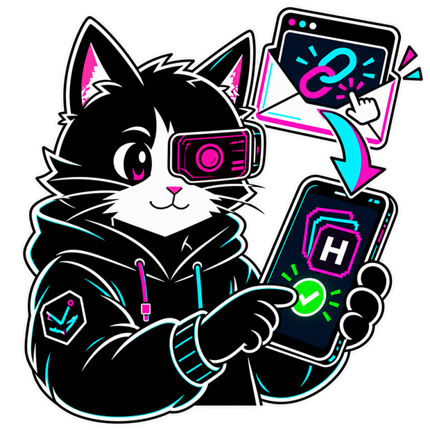

在手機上開啟「活動搶先報」信件中的專屬連結安裝 App，再回到同一封信，用 Token、拍攝 QR 或匯入 QR 圖片登入。下載連結只會帶你到安裝頁，不會自動登入。

> **安全提醒：** Token 與登入 QR Code 都是個人憑證，請勿轉傳、公開或讓他人拍攝。

### 1.2 設定自己的數位卡片

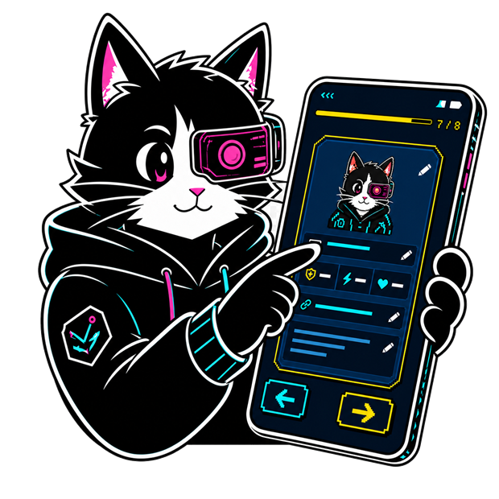

依序完成名稱、圖片、自介、網址、屬性、顏色與預覽；只有顯示名稱必填。在預覽頁確認卡面後再繼續，第 8 步的 Badge 配對可以先跳過。

> **注意：** 跳過配對只是延後處理；要讓別人收集你的卡片，仍必須完成第 1.4 步。

### 1.3 找到 Badge 的 NFC 位置

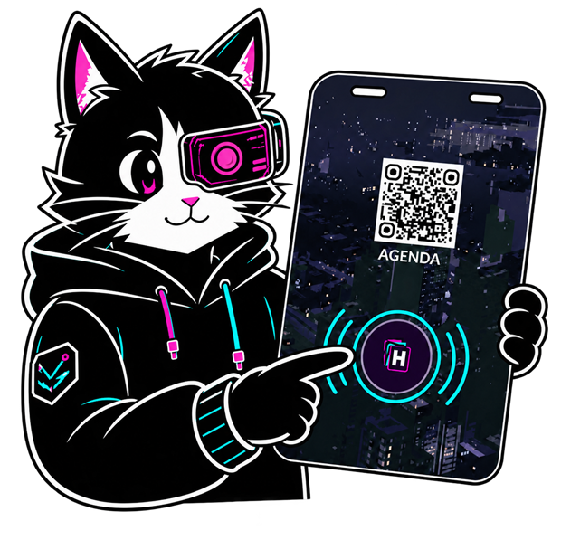

翻到實體 Badge 背面，找到中下方的圓形 `H` 圖示，這裡是 NFC 感應區。配對與交換卡片時，手機都要靠近這個位置。

> **別掃錯：** 背面上方的 `AGENDA` QR Code 是議程表連結，不是配對或收卡用的 QR Code。

### 1.4 配對自己的 NFC Badge

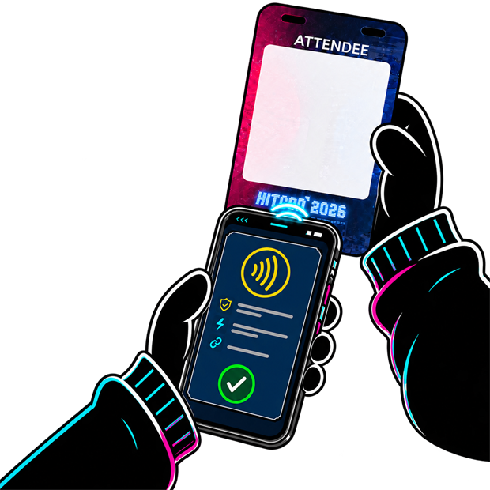

在首次設定第 8 步按「配對 TAG」，或到「我的卡片」按「配對 NTAG Badge」；將手機感應區貼住 Badge 背面中下方，直到 App 顯示完成才移開。

> **注意：** 配對會寫入 Tag、綁定帳號並設定保護。若顯示 Tag 已鎖定、無法寫入或 API 配對失敗，請停止重試並到活動組攤位求助。

### 1.5 感應實體 Badge 交換卡片

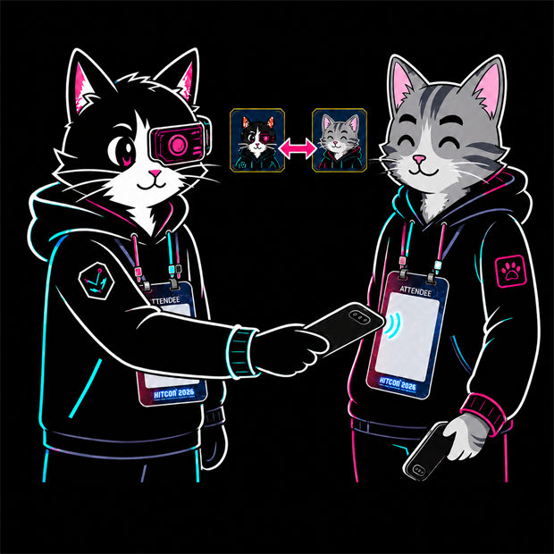

將手機靠近對方 Badge 背面的 NFC 區，等到 App 完成驗證與同步。一次感應只會讓掃描者收到對方卡片；要互換時，A 掃 B 後，B 還要再掃 A 一次。

> **重要：** 收卡必須感應實體 Badge。登入 QR、`AGENDA` QR 或玩家網址都不會加入收藏。

### 1.6 收集 Sponsor／Community 卡並兌獎

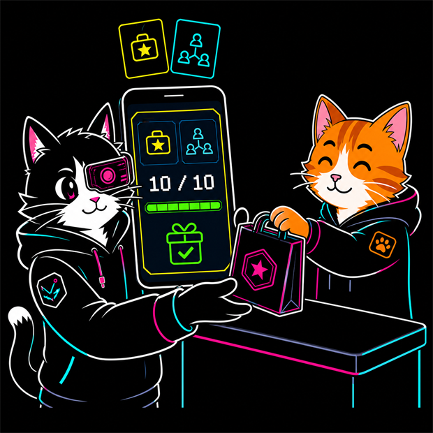

和 Sponsor 或 Community 攤位人員互動後，感應他們的實體 Badge 收集卡片。進度是兩類不重複身分的合計；達到 App 顯示的目標後，帶著已配對的 Badge 到活動組攤位核對領獎。

> **門檻提醒：** App 預設目標為 10，但最終門檻與兌獎資格以 App 當下畫面、伺服器結果及現場公告為準。

## 2. 開始前的準備

請準備：

- 大會寄到報名信箱的專屬登入信。
- 可正常連上網路的 Android 手機或 iPhone。
- 已開啟的 NFC 功能。
- 本次活動配發、含 NTAG 的 NFC Badge。
- 相機或相簿權限（掃描／匯入登入 QR Code，以及匯入個人卡片圖片時可能需要）。

| 功能 | 是否需要網路 | 是否需要 NFC |
| --- | :---: | :---: |
| 登入、同步個人資料 | 是 | 否 |
| 設定／更新卡片 | 是 | 否 |
| 配對自己的 Badge | 是 | 是 |
| 收集其他人的卡片 | 是 | 是 |
| 查看已快取的收藏 | 否 | 否 |
| 送出列印需求 | 是 | 否 |
| 查詢得獎結果 | 是 | 否 |

## 3. 下載與登入

流程圖請見「[快速開始：用專屬信件下載並登入](#11-用專屬信件下載並登入)」。

### 3.1 使用專屬登入信

1. 在手機上開啟大會寄到報名信箱的登入信。
2. 點擊信中的專屬連結。
3. 依頁面指示前往 Google Play 或 TestFlight 安裝 App。
4. 開啟 App，回到同一封登入信，使用其中的 Token 或 QR Code 完成驗證。

下載連結負責帶你前往正確的 App 安裝頁，**不會自動把登入身分帶進 App**；真正登入仍需在 App 登入頁貼上 Token、拍攝 QR 或匯入 QR 圖片。

若在電腦開啟下載頁，頁面會顯示 QR Code；請使用手機掃描後繼續。

### 3.2 登入頁提供的方式

- **貼上 Token：** 將信件中的登入 Token 貼到「登入 Token」欄位後按「登入」。
- **拍攝 QR：** 按「拍攝 QR」，將登入信中的 QR Code 放入框內。
- **匯入 QR：** 若 QR Code 已存成圖片，可從相簿匯入。
- **開啟電子郵件 App：** 回到報名信箱尋找大會登入信。

> 以下 App 畫面取自 staging 測試帳號，實際顯示的個人資料、卡片與進度會不同。

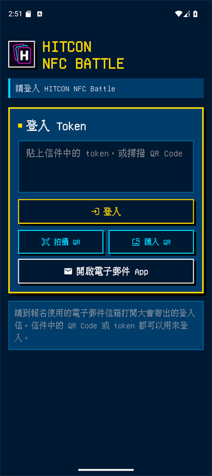

### 3.3 登入注意事項

- 登入 Token 與 QR Code 都是個人憑證，請勿轉傳、公開或讓其他人拍攝。
- Token 必須包含有效使用者身分，且不可過期。
- 如果顯示「這組登入 token 已過期」，請使用大會最新寄出的登入信。
- QR 圖片讀不到時，確認畫面完整、清晰且沒有裁掉邊框；也可以直接貼上 Token。
- App 沒有一般會眾可操作的登出按鈕；若登入錯誤帳號，請洽活動工作人員協助。

## 4. 首次設定個人卡片

流程圖請見「[快速開始：設定自己的數位卡片](#12-設定自己的數位卡片)」。

> 快速開始的漫畫是卡片設定流程的概念示意。實際 App 會把名稱、圖片、自介、網址、屬性、顏色與預覽分成獨立步驟；第 `7 / 8` 步只顯示整張卡片預覽，不會同時出現所有編輯欄位。

登入後會進入「玩家設定」，畫面上方顯示目前進度 `n / 8`。只有顯示名稱必填；其他資料可以使用預設值或留空後繼續。第 8 步可明確選擇「跳過」。

| 步驟 | 設定項目 | 說明 |
| ---: | --- | --- |
| 1 | 顯示名稱 | 卡片與排行榜上顯示的名稱；必填。 |
| 2 | 圖片 | 選預設大頭貼、自己畫，或匯入圖片。 |
| 3 | 自我介紹 | 簡短介紹自己；內容會顯示在卡片詳情。 |
| 4 | 網址 | 可放個人網站或社群連結，也可以留空。 |
| 5 | 屬性 | 最多選 3 個 Emoji 屬性。 |
| 6 | 顏色 | 選擇卡片主色。 |
| 7 | 預覽 | 檢查整張卡片的圖片、文字與配色。 |
| 8 | NFC TAG | 配對自己的 Badge；也可以先跳過。 |

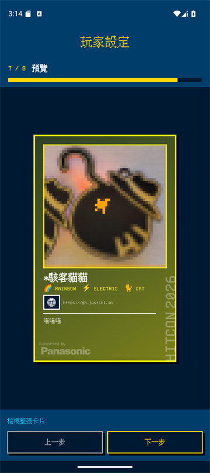

### 4.1 圖片來源與限制

- **預設大頭貼：** 可選駭客貓貓、狗狗、龍、兔子、海豹等點陣角色。
- **自己畫：** 直接進入像素圖片編輯器。
- **匯入圖片：** 支援 PNG、JPG、GIF、WebP，檔案須小於 20 MB。
- 圖片最後會轉成 `48 × 48` 像素；透明區域輸出時會鋪成白色。

### 4.2 網址規則

- 只能使用安全的公開 HTTPS 網址。
- App 會嘗試自動補上 `https://`。
- 不接受本機位址、IP 位址、`.local` 網域或含帳號密碼的網址。
- 首次設定欄位最多輸入 120 個字元。
- 請勿放置詐騙、惡意程式、侵權或其他有害內容。

### 4.3 完成設定

每一步都會嘗試同步到伺服器。完成最後一步並成功儲存後，App 會進入主畫面；若活動方已設定說明網址，App 也會詢問是否查看使用說明。

若換手機或重新安裝 App，可能會再次出現 8 步設定；請確認載入的個人資料正確，並避免在不確定時重新配對其他 Badge。

## 5. 主畫面與導覽

主畫面底部有三個分頁：

| 分頁 | 用途 |
| --- | --- |
| **收集卡片** | 查看已收集卡片、Sponsor／Community 進度與領獎資格。 |
| **我的卡片** | 編輯個人卡片、配對 Badge、列印與備份。 |
| **排行榜** | 查看排名、分數、成就與其他玩家資訊。 |

主畫面上方：

- 左上角 **`?`**：開啟線上使用說明；只有活動方已設定說明網址時才會啟用。
- 右上角色盤：切換 Arcade、Neon、Sunset、Forest、Mono 等畫面主題。主題只套用在目前這次使用，重新啟動後可能恢復預設。
- App 語言跟隨系統語言，目前沒有獨立語言設定頁。
- 一般會眾目前沒有獨立「設定」或「登出」頁。

## 6. 配對自己的 NFC Badge

配對會把你的個人卡片網址寫入 Badge、將實體 Tag UID 綁定到你的帳號，並設定保護。配對完成後，其他會眾才能掃描你的 Badge 收集卡片。

### 6.1 找到 NFC 感應位置

位置圖請見「[快速開始：找到 Badge 的 NFC 位置](#13-找到-badge-的-nfc-位置)」。

圖中右側是**實體 Badge 的背面，不是手機畫面**。背面的圓形 `H` 圖示位於中下方，是 NFC 感應位置。上方標示 `AGENDA` 的 QR Code 是議程表連結，**不是**配對或收卡用的 QR Code。

### 6.2 配對步驟

1. 在首次設定第 8 步按「配對 TAG」，或前往「我的卡片」→「配對 NTAG Badge」。
2. 確認手機 NFC 已開啟且網路穩定。
3. 將手機的 NFC 感應區貼近 Badge 背面中下方。
4. 保持手機與 Badge 不動，直到 App 顯示配對完成。
5. 回到「我的卡片」後，配對按鈕下方應顯示 Tag UID。

> iPhone 的 NFC 感應區通常在手機頂部；Android 手機位置依機型不同，常見於背面中央或上半部。若沒有反應，請沿 Badge 感應區附近緩慢移動手機尋找位置。

### 6.3 配對失敗時

- 不要在配對途中移開 Badge。
- 確認使用自己的 Badge，且 Tag 是支援的 NTAG213／215／216。
- 關閉其他正在使用 NFC 的 App，稍等數秒後再試。
- 若畫面顯示 API 配對失敗、Tag 已鎖定或無法寫入，請停止反覆嘗試並攜帶 Badge 到活動組攤位。
- 目前一般會眾的「解鎖 NTAG」功能可能停用；請勿把解鎖視為正常配對步驟。

## 7. 掃描 Badge、收集與交換卡片

交換流程圖請見「[快速開始：感應實體 Badge 交換卡片](#15-感應實體-badge-交換卡片)」。

### 7.1 收集一張卡片

1. 請對方出示已完成配對的實體 Badge。
2. 將手機 NFC 感應區貼近對方 Badge 背面中下方。
3. 等待 App 顯示：
   - 已偵測到 TAG 訊號
   - 正在驗證實體卡片
   - 正在同步卡片資料
   - 卡片已鎖定
4. 成功後會開啟新卡片預覽，並把卡片加入收藏。

### 7.2 Android 與 iPhone 的差異

| 平台 | 操作方式 |
| --- | --- |
| Android | 通常直接以手機感應 Badge，系統會開啟 App 並驗證實體 Tag。 |
| iPhone | 可在「收集卡片」頁按右下角「掃描」，再把 iPhone 頂部靠近 Badge。若由外部連結開啟，App 會要求再次感應同一張 Badge 取得實體 UID。 |

若 iPhone 第二次掃描到不同 Badge，App 會取消收集；請重新掃描同一張卡片。

### 7.3 交換卡片不是一次雙向完成

一次掃描只會讓「拿手機掃描的人」收藏「被掃描者」的卡片。若兩人要互相交換：

1. A 用手機掃 B 的 Badge。
2. B 再用手機掃 A 的 Badge。

重複掃描同一位使用者不會重複新增卡片或進度。掃到自己的 Badge 時，App 會切換到「我的卡片」。

### 7.4 不要使用 QR Code 或直接點連結收卡

- 登入 QR 只用來登入。
- Badge 背面的 AGENDA QR 只用來開啟議程。
- 玩家卡片網址可以開啟頁面，但不包含實體 Tag UID，因此不會收集卡片。
- 若選擇「我是點連結」，App 會記錄連結事件，且不會新增收藏；計分影響以當下活動規則為準。

## 8. 查看收藏與卡片詳情

### 8.1 收藏首頁

「收集卡片」頁會先顯示本機快取，再向伺服器同步最新資料。你可以：

- 查看已收集的卡片縮圖。
- 查看玩家卡片總數。
- 查看 Sponsor／Community 收集進度。
- 下拉或點離線提示重新同步。
- 使用分享按鈕產生正方形社群分享圖片。

### 8.2 卡片詳情

點一下已收藏卡片，可查看：

- 名稱、像素頭像、Emoji 屬性與卡片顏色。
- 自我介紹與公開 HTTPS 網址。
- NTAG UID 與收藏時間。
- 分享卡片的功能。

點擊外部網址前，App 會顯示離開 App 的確認提示。只開啟你信任的網站。

### 8.3 查看其他玩家的收藏

在排行榜點擊玩家，可開啟該玩家頁面。若你還沒收集他的卡片，收藏內容可能會顯示鎖定或灰色 placeholder；先掃描他的實體 Badge 後再查看。

## 9. Sponsor／Community 集章與領獎

集章流程圖請見「[快速開始：收集 Sponsor／Community 卡並兌獎](#16-收集-sponsorcommunity-卡並兌獎)」。

### 9.1 收集規則

- 與 Sponsor 或 Community 身分的攤位人員互動後，使用實體 NFC Badge 收集其卡片。
- 集章進度為兩種類型的**不重複身分卡合計**。
- 本次 App 預設目標為 10 張；最終門檻以 App 畫面上的「目標」數字為準。
- 重複掃描同一個身分不會重複計算。

> 現場通常可理解為收集不同攤位卡片，但系統實際按「不同 Sponsor／Community 使用者身分」計數。

### 9.2 查看進度

收藏首頁會顯示：

- 贊助商數量
- 社群數量
- 目標
- 剩餘
- 進度條與「收集中／已完成」狀態

達標後會出現「已符合領獎資格，請前往工作人員攤位」。

### 9.3 實體領獎

1. 確認 App 已顯示完成或符合領獎資格。
2. 帶著已配對的實體 Badge 前往指定工作人員攤位。
3. 由工作人員使用管理工具掃描你的 Badge 核對並完成領獎紀錄。

「領取獎品」按鈕只會向伺服器查詢資格與結算結果，不會在手機上直接核銷或發放獎品。排行榜尚未凍結時，這個查詢可能暫時無法回傳任何獎項結果；但如果收藏首頁已顯示「已符合領獎資格」，仍可直接帶 Badge 到工作人員攤位，由工作人員依現場規則核對集章資格。

## 10. 編輯「我的卡片」

前往底部「我的卡片」，可以直接點擊卡片上的欄位或使用下方功能：

卡面下方還有 Badge 配對、列印與備份等控制；請向下捲動畫面查看完整功能。

- 點圖片：開啟圖片來源與像素編輯器。
- 點名稱：修改顯示名稱。
- 點 Emoji：最多選 3 個屬性。
- 點網址：輸入公開 HTTPS 連結，也可以測試開啟。
- 點自我介紹：修改卡片說明。
- 「選擇卡片顏色」：使用預設色或輸入 RGB 自訂色。
- 「配對／重新配對 NTAG」：管理自己的實體 Badge。
- 「列印卡片」：產生列印預覽並送出需求。
- 「備份／還原」：匯出或還原本機收藏快取。

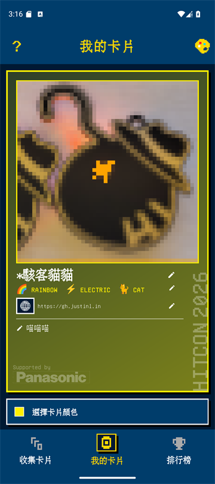

### 10.1 像素圖片編輯器

編輯器包含：

上方工具列可以左右滑動；部分工具不會同時顯示在畫面中。

- 匯入圖片
- 筆刷、橡皮擦、填色與取色
- 復原、重做與清除畫布
- 開啟／關閉網格
- 調整筆刷大小與填色容忍度
- 旋轉、縮放、拖曳與裁切匯入圖片

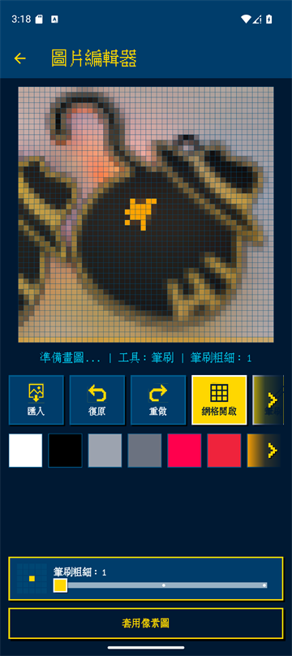

按「套用像素圖」後，再確認儲存到卡片。其他欄位請在各編輯畫面按「儲存」或「套用」後返回，並確保網路正常；目前「我的卡片」不一定會另外顯示自動儲存成功訊息。

## 11. 申請列印實體小卡

App 只負責產生卡面 PNG、送出列印需求及顯示 Code 128 條碼；付款與實際列印都在現場完成。

> 以下四步採用活動方提供的 **2026 現場營運流程**：先到紀念品攤位購買空白小卡，再到活動組指定攤位列印。App 內部分提示仍只寫「紀念品攤位」；若兩者不同，請以現場動線與工作人員指示為準。

### 11.1 步驟一：完成卡片設計

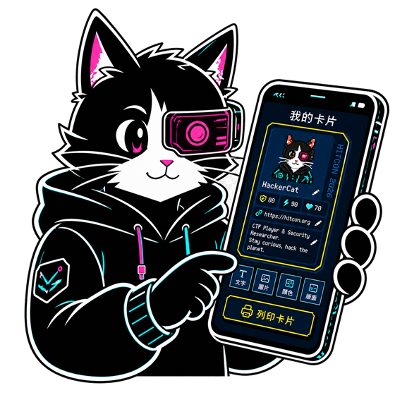

在「我的卡片」確認圖片、名稱、屬性、網址、自我介紹與顏色都正確。

### 11.2 步驟二：送出列印需求

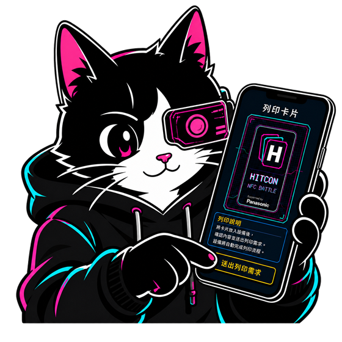

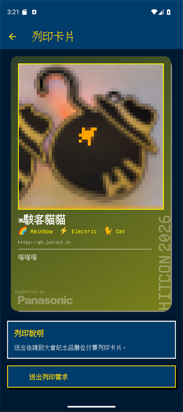

上圖是「送出列印需求」前的預覽畫面。請先仔細核對卡面；送出後會建立一筆新的列印需求。

1. 在「我的卡片」按「列印卡片」。
2. 檢查直式卡面預覽。
3. 按「送出列印需求」。
4. 成功後立即儲存或截圖條碼，也可以複製收件編號。

### 11.3 步驟三：購買空白小卡

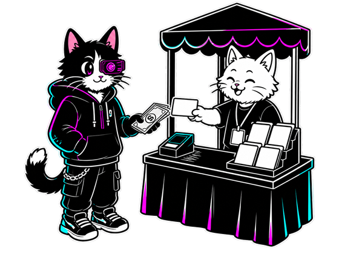

依現場流程前往紀念品攤位付款並購買空白小卡。

### 11.4 步驟四：前往指定攤位列印

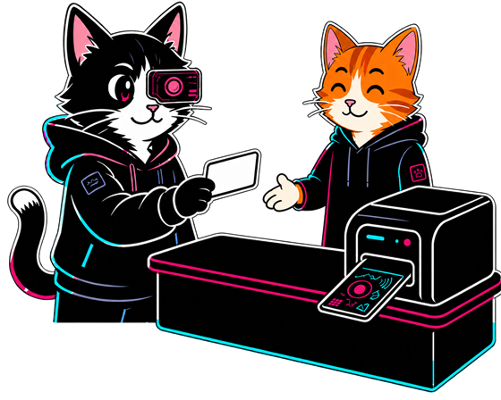

攜帶空白小卡與最新條碼，前往現場公告的指定列印攤位，由工作人員掃描條碼、核對卡面並完成列印。

### 11.5 列印注意事項

- 條碼是列印收件憑證，請勿公開分享。
- App 只保留此裝置目前的列印條碼；沒有完整訂單歷史。
- 「再次送出列印請求」會建立新需求並取代目前保存的條碼；舊條碼可能失效。
- 若 App 提示無法在裝置保存條碼，請立即截圖。
- App 不會直接產生 Word 檔，也不會控制印卡機；工作站會另外套用印卡機校正與列印流程。
- 現場付款、購卡與列印攤位位置若有調整，以現場指示為準。

## 12. 排行榜與成就獎章

### 12.1 排行榜

「排行榜」頁顯示：

- `#名次`
- 玩家顯示名稱
- 分數
- 自己的列會標示「你」
- 「同步中」或「已凍結」狀態

下拉可以更新最新資料；每頁最多顯示 50 筆，可使用上一頁／下一頁。點擊其他玩家可查看他的頁面與收藏狀態。

目前系統在第一次收集每位不同玩家的卡片時加 10 分；使用非實體 Tag 的卡片連結會記錄一次 phishing 事件並扣 10 分。重複收集同一位玩家不會再次加分。

排行榜凍結後會顯示結算快照，目前系統將前 10 名列為排名獎資格。前三列的黃、青、綠只是畫面配色，不能單獨當作得獎證明；若活動方在正式活動前調整規則，仍以 App 最終結算結果及現場公告為準。

### 12.2 成就獎章

| NFC ONLINE | FIRST CONTACT | STAMP MASTER | TOP RANK |
| :---: | :---: | :---: | :---: |
| 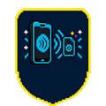 | 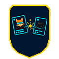 | 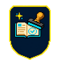 |  |

排行榜上方會顯示成就獎章。點一下獎章可查看取得方式；已解鎖獎章可以產生社群分享圖片。

| 成就 | 取得方向 |
| --- | --- |
| HELLO, WORLD! | 完成顯示名稱、像素頭像與自我介紹。 |
| NFC ONLINE | 配對一枚實體 NFC Badge。 |
| FIRST CONTACT | 收集第一張其他玩家卡片。 |
| PACKET COLLECTOR | 累積不同玩家卡片；依畫面顯示分級門檻。 |
| SPONSOR SCOUT | 累積 Sponsor 身分卡。 |
| COMMUNITY EXPLORER | 累積 Community 身分卡。 |
| FULL STACK SOCIAL | ATTENDEE、STAFF、SPONSOR、COMMUNITY 各收集至少一張。 |
| STAMP MASTER | 完成 Sponsor／Community 集章任務。 |
| TOP RANK | 排行榜結算後達到指定名次門檻。 |
| PRIZE UNLOCKED | 取得任一集章獎或排名獎資格。 |
| PHISHING | 隱藏成就；與非實體 Tag 的連結事件有關。 |
| SOLDER MASTER | 完成會場焊接挑戰並由工作人員確認。 |

Sponsor／Community 成就的分級門檻可由活動方遠端調整；其他成就請以 App 詳情頁顯示的條件為準。Sponsor／Community 個別成就門檻，與兩者合計的集章獎門檻是不同規則。

## 13. 本機備份與還原

前往「我的卡片」→「備份／還原」。

### 13.1 備份方式

- 匯出 JSON 檔到系統檔案管理器。
- 複製 JSON 到剪貼簿。

### 13.2 還原方式

- 從 JSON 檔還原。
- 從剪貼簿貼上 JSON 還原。

### 13.3 備份範圍與限制

備份只包含目前使用者的**本機收藏快取**，不包含：

- 登入 Token
- 個人卡片設計
- 伺服器上的正式資料
- NFC Tag 配對狀態
- 列印條碼或列印需求

還原會覆蓋此裝置目前的本機收藏快取。App 可還原的 JSON 檔上限為 10 MB；請勿手動修改 JSON，也不要公開分享含個人收藏資訊的備份。

## 14. 離線使用、隱私與安全

### 14.1 離線行為

- 已快取的卡片與排行榜資料可能仍可查看，但不一定是最新版本。
- 登入、同步、配對、收卡、送出列印需求及查詢獎項都需要網路。
- 出現「未連上網路」時，確認連線後點提示或下拉重新整理。

### 14.2 個人資料

- 你的名稱、頭像、屬性、自我介紹與公開網址會顯示在玩家卡片中。
- 不要填寫電話、住址、私人帳號憑證或其他不希望被其他會眾看到的資料。
- App 只允許公開 HTTPS 網址；開啟他人網址前仍應確認來源可信。

### 14.3 憑證與條碼

- 不要分享登入 Token、登入 QR Code 或完整登入連結。
- 列印條碼與收件編號只提供給現場工作人員。
- 不要使用別人的登入憑證，也不要把自己的 Badge 配對到別人的帳號。

## 15. 常見問題

### 無法登入

1. 確認使用最新的大會登入信。
2. 檢查網路與手機時間是否正確。
3. 重新掃描完整 QR Code，或直接貼上 Token。
4. 若 Token 已過期，請使用新的登入信或洽工作人員。

### 手機完全感應不到 Badge

1. 確認手機支援 NFC 且已開啟。
2. 移除太厚、含金屬或磁鐵的手機殼。
3. 將手機沿 Badge 背面中下方緩慢移動。
4. iPhone 請使用頂部；Android 請嘗試背面中央至上半部。
5. 關閉其他正在使用 NFC 的 App 後再試。

### 配對到一半失敗

- 保持 Badge 貼近，不要在完成前移開。
- 確認網路穩定。
- 若 Tag 顯示鎖定、無法寫入或 API 配對失敗，停止重試並找活動組工作人員。

### 掃描後沒有收集到卡片

- 確認是感應實體 Badge，不是掃 QR 或點網址。
- 確認對方 Badge 已完成配對。
- 若 iPhone 是由外部 Badge 連結開啟 App，必須在 App 中再次感應同一張 Badge；若一開始就在 App 內按「掃描」，只需依當次 Core NFC 提示完成感應。
- 確認網路正常後再掃一次。
- 同一個人重複掃描不會新增第二張卡。

### 已收集，但卡片預覽打不開

卡片可能已成功記錄，但資料同步暫時失敗。回到收藏頁確認，連線恢復後再下拉更新。

### Sponsor／Community 進度沒有增加

- 同一身分重複掃描不會重複計數。
- 確認對方帳號角色是 Sponsor 或 Community。
- 下拉重新同步；仍不正確時請向工作人員出示自己的 App 畫面。

### 找不到列印條碼

回到「我的卡片」→「列印卡片」，App 會嘗試顯示此裝置保存的最新條碼。如果再次送出，請只保留最新產生的條碼。

### 主題重新啟動後變回預設

這是目前正常行為；色盤選擇只套用在當次 App 使用期間。

### 換手機或重新安裝後又出現首次設定

首次設定完成狀態與收藏快取含有本機資料。重新登入後請先核對個人資料；Badge 配對或收藏若顯示異常，不要隨意配對新 Tag，請先洽工作人員。

## 16. 會場快速檢查表

### 出發交換卡片前

- [ ] 已登入自己的帳號。
- [ ] 個人卡片名稱、圖片與自我介紹正確。
- [ ] 自己的 NFC Badge 已完成配對並顯示 UID。
- [ ] 手機 NFC 與網路已開啟。

### 掃描每張 Badge 時

- [ ] 感應的是 Badge 背面中下方 NFC 區域。
- [ ] 等待 App 顯示同步完成後才移開。
- [ ] 要互換時，雙方都各掃一次。
- [ ] 沒有把登入 QR、AGENDA QR 或玩家網址當成收卡方式。

### 列印與領獎前

- [ ] 保存最新列印條碼與收件編號。
- [ ] 依現場指示完成付款並帶著空白小卡。
- [ ] 領獎時帶著已配對的實體 Badge。
- [ ] 以 App 顯示的最新進度、結算結果與現場公告為準。
